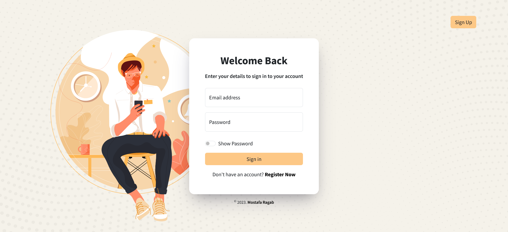
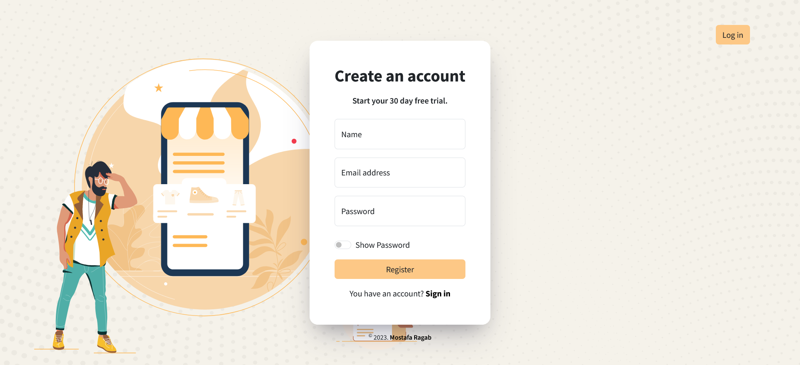

# JavaScript Log In - Sign Up pages (route-assignment-10)

This is my work assigned by [Route-Academy](https://www.linkedin.com/company/routeacademy/mycompany/) during learning front-end web development.

## Table of contents

- [Screenshot](#screenshot)
- [Links](#links)
- [Built with](#built-with)
- [Features](#features)
- [Design Inspiration](#design-inspiration)
- [Author](#author)

### Screenshot

### Links

- Solution URL: [Code]()
- Live Site URL: [Live Site]()

### Built with

- HTML5
- CSS3
- Bootstrap5
- JavaScript
- localStorge
- Regular Expression

### Features

- Validate Email and Password values during user registration.
- Check whether or not the user's email exists in Local Storage during the user sign-in.
- Show password toggle on or off.
- Clean and Minimal UI.

### Design Inspiration

- The UI design inspired by: [DStudio](https://dribbble.com/shots/18063206-Login-UI)

## Author

- GitHub - [IMostafaR](https://github.com/IMostafaR)
- Linkedin - [@imostafarh](https://www.linkedin.com/in/imostafarh/)
